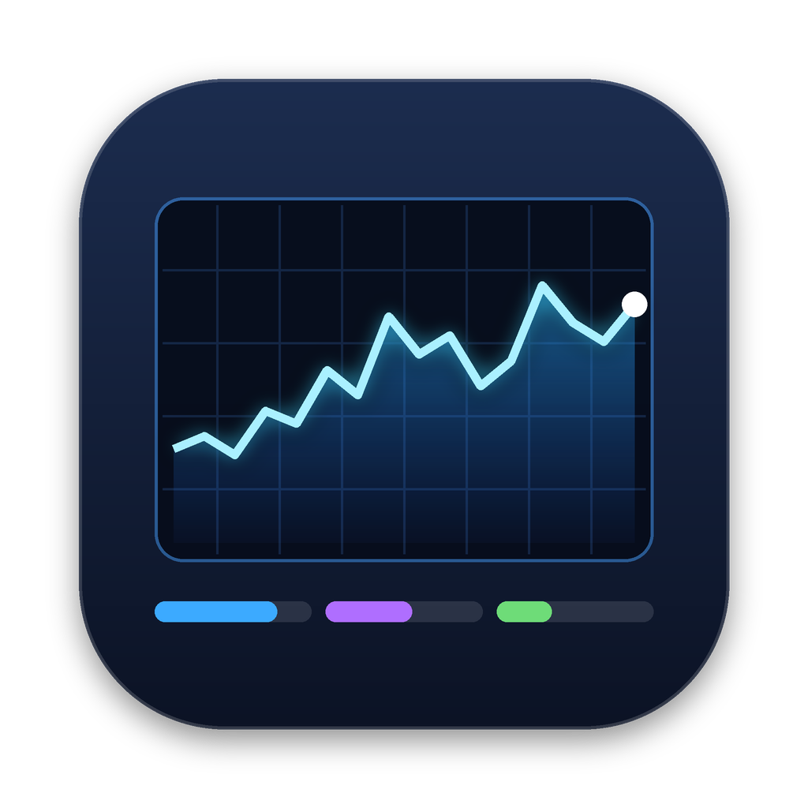

<p align="center">
  
</p>

<h1 align="center">mac-task-manager</h1>

<p align="center">
  Windows の「タスク マネージャー」風のシステムモニターを macOS 向けに SwiftUI で作ったアプリです。<br>
  A Windows Task Manager–style system monitor for macOS, built with SwiftUI.
</p>

<p align="center">
  <a href="https://github.com/pimm-k/mac-task-manager/releases/latest"></a>
  <a href="https://github.com/pimm-k/mac-task-manager/actions/workflows/ci.yml"></a>
  
  
  
</p>

---

## 機能

| タブ | 内容 |
|---|---|
| **プロセス** | 「アプリ」と「バックグラウンド プロセス」に分けて表示。アプリはヘルパー/子プロセスをまとめて合計表示（▶ で展開）。CPU・メモリ・ディスクはヒートマップ色付き |
| **パフォーマンス** | CPU（全体 / 論理プロセッサごと）・メモリ（構成バー）・ディスク（アクティブ時間 / 転送速度）・ネットワーク（アダプター別、IP / MAC 表示）・GPU のリアルタイムグラフ |
| **スタートアップ アプリ** | LaunchAgents / LaunchDaemons の一覧と有効化・無効化 |
| **ユーザー** | ユーザー別の CPU・メモリ・ディスク使用量と、そのユーザーのプロセス |
| **詳細** | 全プロセスの PID・状態・ユーザー・CPU 時間・スレッド・優先度・パス。優先度の変更、プロセス ツリーの終了 |

- タスクの終了 / 強制終了（Delete キー対応）
- 新しいタスクを実行（⌘N）
- タブ切り替え（⌘1〜⌘5）、検索、更新速度の変更、常に手前に表示
- root など他ユーザーのプロセスの操作は、確認後に管理者パスワードで実行

## 動作環境

- macOS 14 (Sonoma) 以降
- Xcode または Command Line Tools（`xcode-select --install`）

## ダウンロード

[Releases](https://github.com/pimm-k/mac-task-manager/releases/latest) からビルド済みの `TaskManager-vX.Y.Z.zip` をダウンロードできます。
Apple の公証を受けていないため、初回は「システム設定」→「プライバシーとセキュリティ」→「このまま開く」で起動を許可してください。

## ビルドと実行

```bash
git clone https://github.com/pimm-k/mac-task-manager.git
cd mac-task-manager

# すぐに動かす
swift run

# .app を作成して /Applications にインストール
./build_app.sh --install
```

> ⚠️ `cp -R` で既存の `/Applications/TaskManager.app` に上書きすると、署名が食い違って起動直後に強制終了します。必ず `--install` を使うか、古いアプリを削除してからコピーしてください。

> 自分の Mac でビルドしたアプリは、そのまま警告なしで起動できます。

## プロジェクト構成

```
Sources/TaskManager/
├── TaskManagerApp.swift      … エントリーポイント
├── Data/
│   ├── Monitor.swift         … 定期更新・履歴・終了などの操作
│   ├── ProcessSampler.swift  … libproc でプロセス情報を取得
│   ├── SystemSampler.swift   … CPU / メモリ / ディスク(IOKit) / ネットワーク / GPU
│   └── LaunchItems.swift     … LaunchAgents / Daemons の読み込みと切り替え
├── Views/                    … 各タブの画面
└── Util/Utilities.swift      … 書式・sysctl・シェル実行
scripts/release.sh            … リリース (バージョン更新・CHANGELOG・タグ作成)
.github/workflows/            … CI (自動ビルド) と Release (自動公開)
VERSION                       … バージョン番号 (唯一の正)
Resources/
├── Info.plist
├── AppIcon.icns
└── icon/                     … アイコン原画と生成スクリプト
```

## 制限事項

- 他ユーザー（root）のプロセスは macOS の権限上、詳細を取得できないため CPU 時間・メモリを `ps` から取得しています（スレッド数は「—」表示）。
- プロセスごとのネットワーク・GPU 使用量は公開 API がないため表示していません。
- 「ログイン項目」（SMAppService で登録されたもの）は一覧取得 API がないため、システム設定を開くボタンで対応しています。
- App Sandbox と両立しない機能を使っているため、Mac App Store では配布していません。

## バージョン管理

- バージョン番号は [セマンティック バージョニング](https://semver.org/lang/ja/) に従い、`VERSION` ファイルで管理しています（アプリのサイドバー下部にも表示）。
- 変更履歴は [CHANGELOG.md](CHANGELOG.md)、開発とリリースの手順は [CONTRIBUTING.md](CONTRIBUTING.md) をご覧ください。

## セキュリティ

ネットワーク通信なし・外部ライブラリなしの構成です。管理者権限が必要な操作は、実行するコマンドを表示したうえで macOS 標準の認証ダイアログで確認します。詳しくは [SECURITY.md](SECURITY.md) をご覧ください。脆弱性の報告も SECURITY.md の手順でお願いします。

## ライセンス

使用・無改変での再配布は自由ですが、**改変および改変版の配布は禁止**です。詳しくは [LICENSE](LICENSE) をご覧ください。

本プロジェクトは Microsoft とは関係のない個人制作のアプリです。「タスク マネージャー」は Windows の同名機能を参考にした呼び名です。
